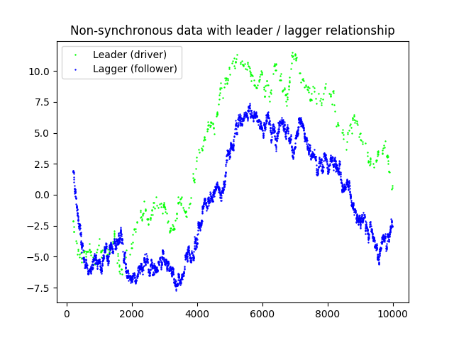
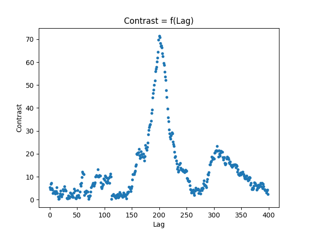
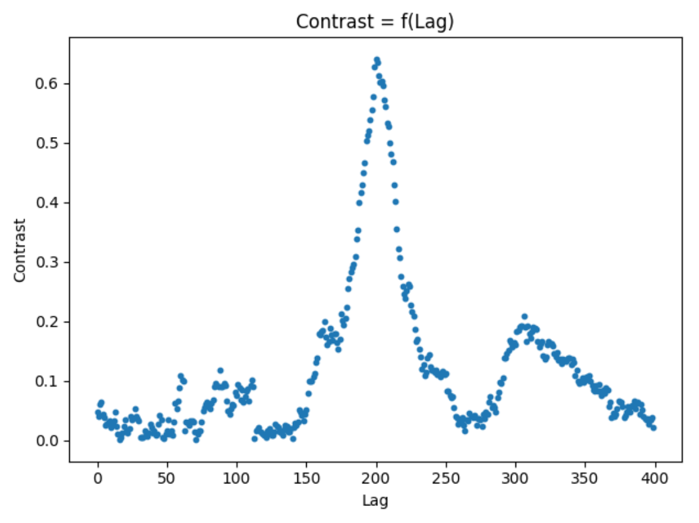
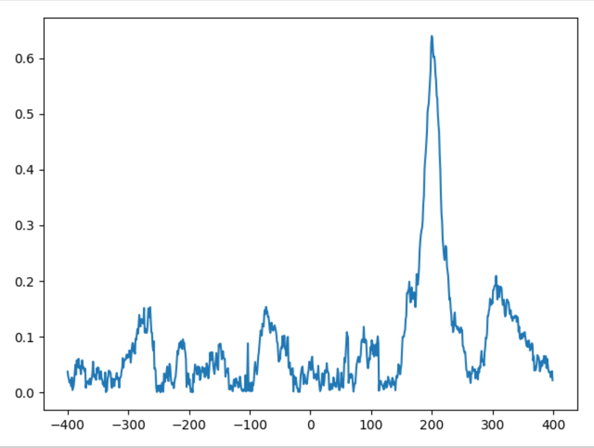
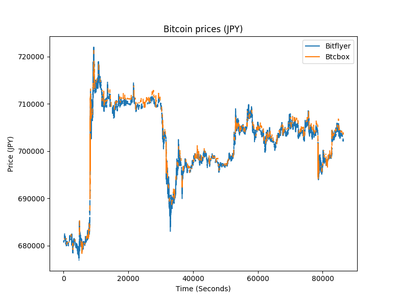
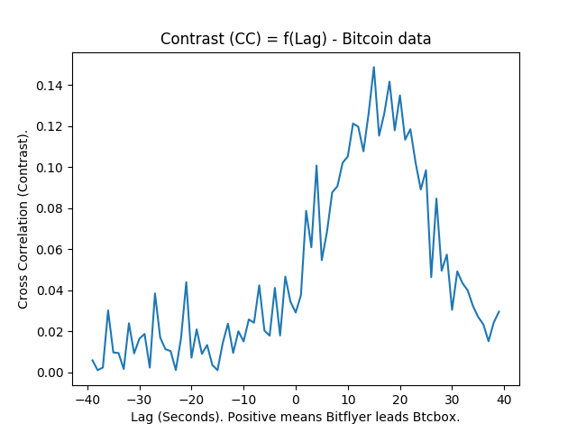

## Estimation of the lead-lag parameter from non-synchronous data [[paper](https://arxiv.org/abs/1303.4871)]

*Works on Linux, MacOS and Windows (Microsoft Visual C++ 14.0 or greater is required for Windows).*

> Abstract: We propose a simple continuous time model for modeling the lead-lag effect between two financial
assets. A two-dimensional process (Xt, Yt) reproduces a lead-lag effect if, for some time shift
ϑ ∈ R, the process (Xt, Yt+ϑ) is a semi-martingale with respect to a certain filtration. The
value of the time shift ϑ is the lead-lag parameter. Depending on the underlying filtration,
the standard no-arbitrage case is obtained for ϑ = 0. We study the problem of estimating the
unknown parameter ϑ ∈ R, given randomly sampled non-synchronous data from (Xt) and (Yt).
By applying a certain contrast optimization based on a modified version of the Hayashi–Yoshida
covariation estimator, we obtain a consistent estimator of the lead-lag parameter, together with
an explicit rate of convergence governed by the sparsity of the sampling design. The complexity is
**O(n.LOG(n))**.

### API

Calculate the time lag (delay) in seconds between two time series in Python using the `lead_lag` module.

```python
lead_lag.lag(ts1: pd.Series, ts2: pd.Series, max_lag: Union[float, int]) -> Optional[float]
```

#### Arguments
- `ts1`: This is a Pandas Series containing the first time series data.
- `ts2`: This is another Pandas Series containing the second time series data.
- `max_lag`: defines a time interval within which the optimal lag is sought: `[-max_lag, max_lag]`.

It's important to note that the timestamps in the two input series, need not be synchronized. This means that the data points in these series don't have to occur at the exact same times. The module can handle non-synchronous data. However, for efficiency reasons, the smallest achievable lag is set at 100 microseconds.

#### Returns
The signed estimated `lag`, expressed in seconds. 
- If the calculated lag is positive, it implies that `ts1` leads `ts2`.
- If the calculated lag is negative, it implies that `ts2` leads `ts1`.
-  If any issues arise during the calculation, the function returns `None`.

There is also a `lead_lag.LeadLag` object, which offers more features. Refer to the examples to learn how to use it.

### Example

Here's how the library operates using the simplest example:

```python
from datetime import datetime, timedelta

import numpy as np
import pandas as pd

from lead_lag import lag

ts = pd.Series(
    data=np.cumsum(np.random.uniform(low=-1, high=1, size=1000)),
    index=[datetime(2022, 1, 1, 12, 0, 0) - timedelta(seconds=i) for i in range(1000)]
)
print('lag=', lag(ts, ts.shift(-9), max_lag=10))
# lag= 9.0
```

### Installation

Follow those steps to install it:

```bash
# 1. PyPI. Recommended for all platforms (Windows, Linux, MacOS)
pip install lead_lag

# 2. From the repository link.
# Via SSH.
pip install git+ssh://git@github.com/philipperemy/lead-lag 
# Or via HTTPS.
pip install git+https://github.com/philipperemy/lead-lag.git

# 3. From the sources.
git clone https://github.com/philipperemy/lead-lag.git && cd lead-lag
virtualenv -p python3 venv && source venv/bin/activate
make
```

### More Examples

You can gain further insight into the library's functionality by exploring the contents of the [examples](examples) directory. In particular:

- There's an example titled "FTX vs Bitmex lead lag," which examines the relationship between FTX and Bitmex exchanges. In this case, FTX leads Bitmex, and the calculated lag amounts to 90 milliseconds. This observation is based on data from September 27th, 2022.
- Another example named "Bitflyer vs Btcbox lead lag" investigates the lead-lag dynamics between Bitflyer and Btcbox exchanges. The findings suggest that Bitflyer leads Btcbox, and the computed lag stands at 15 seconds. The data for this comparison pertains to the year 2018.

You can also run the Jupyter Notebook [lead_lag_example_2.ipynb](notebooks/lead_lag_example_2.ipynb):

```bash
make jupyter
```

### Numerical Illustrations

#### Non-synchronous data (generated from the Brownian Bachelier model)

We simulate a lead-lag Bachelier model without drift with: 

N = 10,000 (grid on which we sample random arriving times for both X and Y), #I = 500, #J = 3,000, ρ = 0.80, x0 = 1.0, y0 = 2.1, s1 = 1.0, s2 = 1.5, lead_lag = 200 (X is the leader, Y the lagger), finite grid Gn = [0, 400]. 

We show a realization of the process (Xt, Yt) and its corresponding Constrast vs Lag plot:

<p align="center">
  
</p>


<p align="center">
  
</p>

*The contrast is just a positive definitive cross correlation quantity.*

Clearly, the argmax of the contrast is located around the correct value (lead_lag = 200). We also observe some
persistence in the contrast (I may have forgotten an extra term in the modified HY estimator). Even though X has a
sampling rate 7x lower than Y, the estimator can still pick up the correct value. We can also normalize the contrast to
have an unbiased estimation of the cross correlation function rho for different lags. In theory this function should be
a Dirac centered around the lead_lag parameter with ρ(lead_lag) = 0.8 and 0 elsewhere.

<p align="center">
  
</p>

We can also look at negative lags and define the LLR (standing for Lead/Lag Ratio) to measure the lead/lag
relationships. If LLR > 1, then X is the leader and Y the lagger and vice versa for LLR <= 1. In our case, for the
realization of our process (X,Y), we find LLR ~ 8.03.

<p align="center">
  
</p>

#### Non-synchronous data (Bitcoin markets)

We now consider a real world use case where we have two Japanese bitcoin exchanges: bitflyer and btcbox. The former has
higher liquidity hence we expect it to lead the latter. If we plot the prices of BTC/JPY for both exchanges for a
specific day, we get:

<p align="center">
  
</p>

So which one leads? We apply the same lead lag procedure using the constrast quantity computed on a
grid `Gn = ]-40,40[` (unit is second here).

<p align="center">
  
</p>

The contrast is maximized for ϑ = 15 seconds. This promptly means that bitflyer is the leader as expected and that
btcbox takes on average 15 seconds to reflect any changes on its price.

### References

- [High-Frequency Covariance Estimates With Noisy and Asynchronous Financial Data](https://www.princeton.edu/~yacine/QMLE2D.pdf)
- [On covariance estimation of non-synchronously observed diffusion](http://www.ms.u-tokyo.ac.jp/~nakahiro/mypapers_for_personal_use/hayyos03.pdf)
- [Estimation of the lead-lag parameter from non-synchronous data](https://arxiv.org/pdf/1303.4871.pdf)
- https://stats.stackexchange.com/questions/235697/semi-martingale-vs-martingale-what-is-the-difference?rq=1
